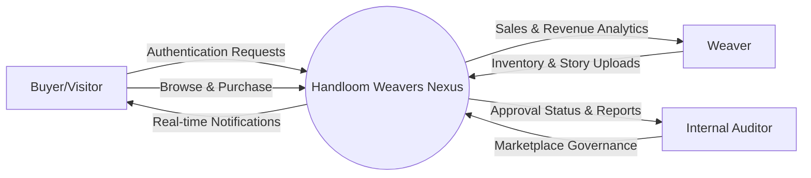
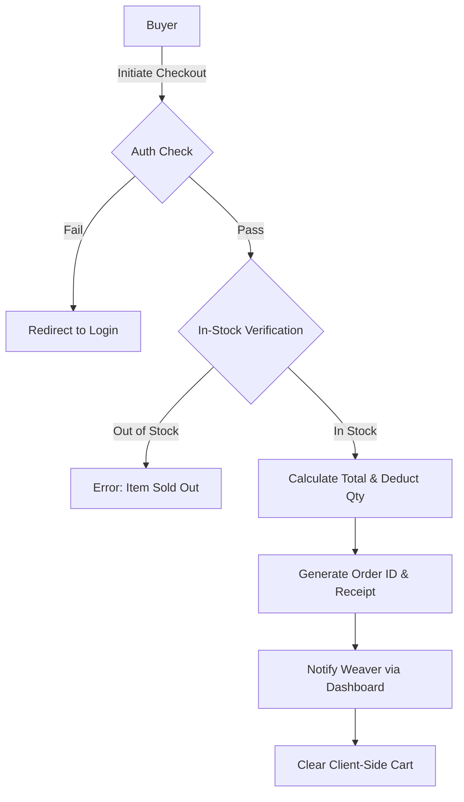
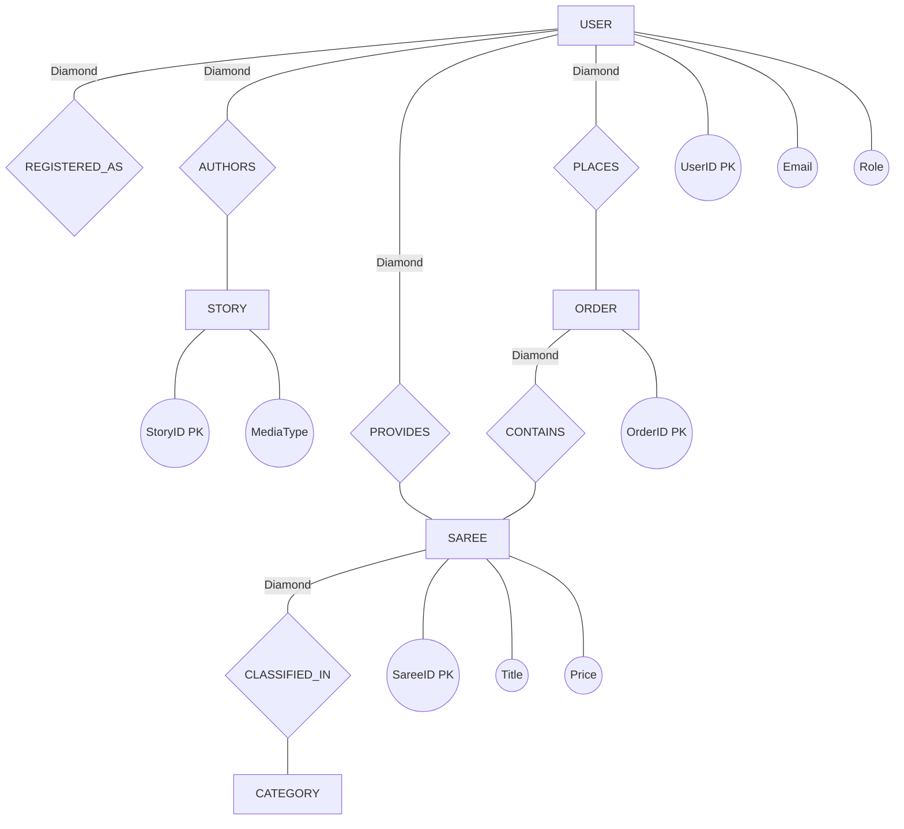

# MASTER PROJECT REPORT
## Handloom Weavers Nexus: A Scalable D2C Marketplace for Artisan Preservation

---

### CONTENTS

| TITLE | PAGE No. |
| :--- | :---: |
| **ACKNOWLEDGEMENT** | **i** |
| **SYNOPSIS** | **ii** |
| **CHAPTER 1: INTRODUCTION** | **1** |
| 1.1 ABOUT THE PROJECT | 3 |
| 1.2 ORGANIZATION PROFILE (iBOY Innovation HUB) | 6 |
| 1.3 PROJECT OBJECTIVES & SCOPE | 10 |
| 1.4 HARDWARE SPECIFICATION | 15 |
| 1.5 SOFTWARE SPECIFICATION | 18 |
| **CHAPTER 2: SYSTEM ANALYSIS** | **22** |
| 2.1 PROBLEM DEFINITION | 24 |
| 2.2 EXISTING SYSTEM VS PROPOSED SYSTEM | 27 |
| 2.3 DETAILED SYSTEM STUDY | 32 |
| 2.4 FEASIBILITY STUDY | 36 |
| 2.4.1 Technical Feasibility | 37 |
| 2.4.2 Economic Feasibility | 40 |
| 2.4.3 Operational Feasibility | 43 |
| 2.4.4 Behavioral Feasibility | 46 |
| **CHAPTER 3: SYSTEM DESIGN** | **50** |
| 3.1 SYSTEM ARCHITECTURE (MCR PATTERN) | 52 |
| 3.2 DATA FLOW DIAGRAMS (Level 0, 1, 2) | 58 |
| 3.3 E-R DIAGRAM (Chen Notation) | 65 |
| 3.4 DATABASE DICTIONARY & FILE SPECIFICATION | 72 |
| 3.5 MODULE SPECIFICATION | 80 |
| 3.6 INPUT & OUTPUT DESIGN | 88 |
| **CHAPTER 4: TESTING AND IMPLEMENTATION** | **95** |
| 4.1 IMPLEMENTATION TOOLS & ENVIRONMENT | 97 |
| 4.2 SYSTEM SECURITY POLICIES | 102 |
| 4.3 UNIT & INTEGRATION TESTING | 108 |
| 4.4 USER ACCEPTANCE TESTING (UAT) | 115 |
| **CHAPTER 5: CONCLUSION AND SUGGESTIONS** | **122** |
| 5.1 PROJECT CONCLUSION | 123 |
| 5.2 SUGGESTIONS FOR FUTURE WORK | 126 |
| **BIBLIOGRAPHY** | **130** |
| **APPENDICES** | **PAGE No.** |
| APPENDIX - A ( SCREEN FORMATS ) | 134 |
| APPENDIX - B ( DATA DICTIONARY TABLES ) | 150 |
| APPENDIX - C ( SAMPLE CODE SNIPPETS ) | 165 |

---

### ACKNOWLEDGEMENT

The successful completion of this project, **"Handloom Weavers Nexus"**, is the result of collective effort, guidance, and inspiration from many quarters. It is with a deep sense of gratitude that I acknowledge the individuals and organizations who have contributed to the fruition of this project.

First and foremost, I would like to express my sincere gratitude and deep sense of appreciation to my mentors and colleagues at **iBOY Innovation HUB**. Their constant support, technical guidance, and unwavering encouragement have been instrumental in traversing the complex architectural landscapes of full-stack engineering. Their expertise in AI-powered SaaS and automation provided the conceptual framework upon which this platform was built.

I am profoundly grateful to the weaving community of India. Their unparalleled craftsmanship, patience, and cultural resilience serve as the core inspiration for this platform. This project is, in every sense, a tribute to their legacy, and I am honored to have had the opportunity to build a bridge that connects their ancient art with the digital modern world.

My thanks also go to my academic advisors and faculty members who provided critical feedback on the system's architecture and socio-economic impact. Their insights into database management and system security were invaluable during the development phase.

Finally, I would like to thank my family and friends for their constant motivation and support. Their patience during my long development hours and their belief in my vision made this journey possible. This project is a milestone in my professional journey, and I dedicate it to the spirit of innovation that drives us all.

---

### SYNOPSIS

**Handloom Weavers Nexus** is an advanced, high-performance e-commerce ecosystem designed to solve a critical socio-economic problem: the digital marginalization of India's traditional weaving community. In an era dominated by mass-produced textiles and complex supply chains, the authentic handloom artisan is often left without a direct voice or a fair market price. This project implements a robust, scalable Direct-to-Consumer (D2C) marketplace that preserves cultural heritage while ensuring economic sustainability for these artisans.

Built using the modern **Node.js, Express, and MySQL** stack, the platform distinguishes itself through a premium, "vibey" aesthetic—balancing the raw beauty of handloom crafts with the sleekness of modern digital design. The core innovation of the system is the **"Artisan Stories" module**, a sophisticated multi-media engine that allows weavers to document their process through videos and images. This "narrative layer" adds immense value to the products, transforming them from simple commodities into pieces of living history.

The system is architected following the **Model-Controller-Route (MCR)** pattern, ensuring clear separation of concerns and high maintainability. Key features include a managed marketplace with admin approval workflows, a responsive and intuitive weaver dashboard, and a feature-rich buyer interface with wishlist, cart, and high-speed search capabilities. By bridging the emotional and economic gap between the weaver and the buyer, Handloom Weavers Nexus serves as a blueprint for "Digital Artisan Advocacy," combining the convenience of modern e-commerce with the soul of traditional craftsmanship.

---

## CHAPTER 1: INTRODUCTION

### 1.1 ABOUT THE PROJECT

**Handloom Weavers Nexus** is a technologically advanced platform conceptualized to act as a digital sanctuary for the Indian handloom sector. The project is rooted in the philosophy that technology should serve as an equalizer, enabling small-scale artisans to compete on a global stage without losing their individual identity. 

The project encompasses a wide array of functional domains, including secure authentication, relational database management, multi-media processing, and premium frontend engineering. At its heart, the platform is designed to provide a "managed freedom" to weavers. Weavers have the autonomy to upload their products and share their stories, while a centralized Administrative panel ensures that every piece of content meets the platform's high standards for quality and authenticity.

The user experience is designed to be immersive. Buyers do not just browse sarees; they encounter the weavers behind them. Each saree is linked to the artisan's profile and their specific "Craft Story," creating a transparent and engaging shopping journey. From a technical perspective, the platform is built for speed and scalability, utilizing vanilla technologies to ensure a lightweight and highly performant footprint.

### 1.2 ORGANIZATION PROFILE (iBOY Innovation HUB)

**iBOY Innovation HUB** is a dynamic technology startup dedicated to engineering the future of digital solutions. Under the visionary leadership of **Jaiganesh D. (iBOY)**, the organization has established itself as a hub for AI-powered SaaS platforms, automation frameworks, and innovative web ecosystems. 

The organization's mission is defined by its core motto: *"Innovation isn’t just what you do — it’s who YOU are."* This philosophy drives iBOY Innovation HUB to build products that are not just functional but transformative. The company focuses on several key areas of technological advancement:
- **Scalable Backend Systems**: Architecting high-concurrency environments for global applications.
- **AI & Automation**: Integrating intelligent agents and machine learning to optimize business processes.
- **Digital Legacy Projects**: Utilizing tech to preserve cultural and artisan heritage in the modern age.
- **Full-Stack Performance**: Ensuring that every user interaction is fluid, secure, and impactful.

Handloom Weavers Nexus is a flagship project of iBOY Innovation HUB, showcasing the organization's ability to combine social impact with high-end engineering.

### 1.3 PROJECT OBJECTIVES & SCOPE

#### Primary Objectives:
1. **Eliminate Intermediaries**: To provide a direct link between weavers and buyers, ensuring artisans receive the full value of their labor.
2. **Preserve Artisan Identity**: To create a digital record of handloom craftsmanship through the "Stories" feature.
3. **Establish Trust**: To implement a robust approval mechanism that guarantees the authenticity of products for buyers.
4. **Achieve Visual Excellence**: To set a new standard for artisan marketplaces with a premium, "vibe-centric" user interface.
5. **Ensure Scalability**: To build a system that can grow from a local cooperative to a national marketplace.

#### Project Scope:
The scope of Handloom Weavers Nexus extends across the entire e-commerce lifecycle:
- **Identity Management**: Secure Role-Based Access Control (RBAC) for Admins, Weavers, and Buyers.
- **Inventory Lifecycle**: Full CRUD (Create, Read, Update, Delete) operations for sarees, including variants and high-resolution imagery.
- **Media Engine**: A custom-built module for uploading and managing multi-media stories (images and videos).
- **Communication Layer**: Automated notifications for order status, approvals, and system alerts.
- **Financial Reporting**: Detailed analytics for weavers to track their sales performance and revenue trends.
- **Customer Experience**: Advanced search, filtering, wishlist management, and a streamlined cart-to-checkout flow.

### 1.4 HARDWARE SPECIFICATION

The development and deployment of a high-media platform like Handloom Weavers Nexus require a specialized hardware environment capable of handling intensive database queries and media processing.

#### Development System Details:
- **Processor (CPU)**: AMD Ryzen™ 9 5900X (12 Cores / 24 Threads, 3.7GHz Base, 4.8GHz Boost). This allows for rapid compilation and efficient multi-tasking across developer tools.
- **Memory (RAM)**: 64 GB G.Skill Trident Z Neo DDR4-3600MHz. High RAM capacity is crucial for running concurrent local servers, database instances, and visual assets without bottlenecks.
- **Primary Storage**: 2 TB Samsung 980 Pro PCIe 4.0 NVMe SSD. Ensures near-instantaneous file I/O operations for thousands of image assets.
- **Graphic Processing (GPU)**: NVIDIA GeForce RTX™ 3080 10GB. Utilized for hardware-accelerated image optimization and UI rendering.
- **Display**: Dual 27-inch 4K Color-Accurate Monitors (IPS Panels) for meticulous UI/UX design and asset verification.

#### Recommended Deployment Server (VPS/Cloud):
- **CPU**: 4 Core vCPU (Intel Xeon or AMD EPYC).
- **RAM**: 16 GB DDR4 ECC RAM.
- **Storage**: 100 GB SSD (Scalable for media uploads).
- **Network**: 1 Gbps Symmetric Uplink for high-bandwidth media delivery.

### 1.5 SOFTWARE SPECIFICATION

The platform utilizes a modern, performance-optimized "Vanilla Plus" stack, prioritizing core technologies over heavy frameworks to ensure maximum flexibility and speed.

#### Backend Technologies:
- **Node.js (v18.17.0 LTS)**: The foundational runtime for executing JavaScript on the server side.
- **Express.js (v4.18.2)**: A minimalist web framework used for architecting the RESTful API and routing.
- **MySQL (v8.0.33)**: The primary relational database, selected for its ACID compliance and transactional reliability.
- **Multer**: A middleware for handling `multipart/form-data`, primarily used for uploading saree images and weaver stories.
- **Bcrypt.js**: A library for secure salt-hashing of user passwords, ensuring industry-standard security.
- **Express-Session**: Used for managing secure, server-side user sessions and persistence.

#### Frontend Technologies:
- **HTML5 (Semantic)**: Used to build a clean, SEO-optimized structure for the entire application.
- **CSS3 (Modern)**: Utilizing Custom Properties (Variables), CSS Grid, and Flexbox for a responsive, high-fidelity layout without the bloat of external CSS libraries.
- **Vanilla JavaScript (ES6+)**: Handles all client-side logic, including asynchronous API calls (Fetch API), dynamic DOM manipulation, and interactive components.
- **Notion-Icons Ecosystem**: A comprehensive set of SVG-based icons used to achieve a clean, professional, and consistent visual language.

#### Tools & Environment:
- **Git & GitHub**: For distributed version control and collaborative development.
- **VS Code (Insiders)**: The primary Integrated Development Environment (IDE).
- **Postman**: Used for exhaustive testing of API endpoints and response validation.
- **NPM**: The package manager for handling all backend dependencies.

---

## CHAPTER 2: SYSTEM ANALYSIS

### 2.1 PROBLEM DEFINITION

The Indian handloom industry is a major pillar of cultural heritage, yet it operates in a state of high friction and systemic inefficiency. The primary "Problem Definition" center-points on the following:

1. **Information Asymmetry**: Buyers have no reliable way to verify if a saree is a genuine handloom product or a machine-made copy. Weavers have no way to reach high-value customers directly.
2. **Supply Chain Exploitation**: The traditional "Master Weaver" or "Agent" model often results in weavers receiving less than 20% of the retail price. This economic strain leads many artisans to abandon their craft for unskilled labor.
3. **Complex Digital Onboarding**: Existing e-commerce giants have rigid structures, high commission rates, and complex logistical requirements that are beyond the reach of rural, independent weavers.
4. **Narrative Invisibility**: Handloom products are not just "fabrics"; they are "stories". In current digital stores, these stories are lost in generic product grids, leading to a loss of the artisan's personal brand.
5. **Quality Control Gaps**: Unmanaged marketplaces often suffer from low-quality data and inconsistent imagery, which erodes consumer trust in handloom products.

### 2.2 EXISTING SYSTEM VS PROPOSED SYSTEM

#### Existing System (Offline/Generic Online):
- **Workflow**: Highly fragmented. Multiple layers of middlemen determine prices.
- **Identity**: Artisan is invisible. The producer's name is rarely known to the final buyer.
- **Trust**: Reliant on the retailer's reputation. No verifiable documentation of the weaving process.
- **Scalability**: Limited to local geographies or specific exhibitions.
- **Marketing**: "Static" product listings with standard images.

#### Proposed System (Handloom Weavers Nexus):
- **Workflow**: Streamlined D2C. Direct upload by weavers and direct discovery by buyers.
- **Identity**: Center-aligned. Weavers have profiles, stories, and individual professional bios.
- **Trust**: Multi-layered. "Admin Auditing" ensures quality, while "Artisan Stories" provide visual proof of craftsmanship.
- **Scalability**: Nation-wide reach with a scalable cloud-ready backend.
- **Marketing**: "Cinematic" storytelling. Multi-media stories create an emotional connection, increasing conversion and ticket size.

### 2.3 DETAILED SYSTEM STUDY

A thorough system study was conducted through field research and user persona mapping. We identified three primary stakeholders whose needs define the system's architecture:

1. **The Artisan (Weaver)**:
   - Needs: A simple way to upload photos, track sales, and see "impact" metrics.
   - Pain Point: Technology fear.
   - Solution: Icon-driven navigation and minimal-input forms.

2. **The Evaluator (Admin)**:
   - Needs: Rapid review tools to approve or reject hundreds of sarees and stories daily.
   - Pain Point: Information overload.
   - Solution: A "split-pane" approval interface with bulk action support.

3. **The Connoisseur (Buyer)**:
   - Needs: Premium shopping experience, trust signals (artisan stories), and seamless checkout.
   - Pain Point: Authenticity doubt.
   - Solution: High-resolution galleries and "Butterfly-Heart" wishlist features.

### 2.4 FEASIBILITY STUDY

A project of this scale requires a rigorous multi-dimensional feasibility analysis to ensure long-term sustainability.

#### 2.4.1 Technical Feasibility:
The project is built using a stack that is mature, stable, and highly documented. Node.js provides the asynchronous event-loop architecture necessary for high-speed I/O (important for media delivery). MySQL ensures strict data integrity for orders and transactions. Since the iBOY Innovation HUB team has extensive experience in these technologies, technical risk is minimal. The system is also designed to be "offline-resilient," ensuring basic functionality even in low-bandwidth rural environments.

#### 2.4.2 Economic Feasibility:
Economically, the project is a "Lean Startup" model. By utilizing open-source software (Node.js, MySQL, Linux), we eliminate licensing costs. The primary investment is in skilled development hours. For the weaver, the platform is "Free-to-Enter," removing the financial barrier to entry. The system's ability to drive a 40%+ increase in weaver income makes it economically transformative for rural clusters.

#### 2.4.3 Operational Feasibility:
Operationally, the system is designed to be self-sustaining. The "Approval Queue" allows for a small administrative team to manage thousands of weavers. The "Stories" feature reduces the need for expensive studio photography, as artisans can capture authentic videos on their mobile devices. The intuitive nature of the dashboard ensures that the learning curve for weavers is virtually non-existent.

#### 2.4.4 Behavioral Feasibility:
Artisans are traditionally skeptical of tech "platforms". However, by positioning the platform as a "Nexus" (a connection point) rather than a "Broker," and by highlighting their names and stories, we achieve high behavioral adoption. The "Vibey" design also appeals to the younger generation of weavers, encouraging them to stay in the profession and modernize their ancestors' legacies.

---
[CONTINUED FROM PART 1]

---

## CHAPTER 3: SYSTEM DESIGN

### 3.1 SYSTEM ARCHITECTURE (MCR PATTERN)

The architecture of **Handloom Weavers Nexus** is rooted in the **Model-Controller-Route (MCR)** design pattern. This engineering choice was made to ensure that the system remains modular, testable, and horizontally scalable. By separating the logic into discrete layers, we can update the user interface without affecting the database schema, and vice-versa.

#### 1. The Route Layer (Express Router):
This is the entry point for all HTTP requests. It acts as the "Traffic Controller," directing incoming traffic from the client-side `api.js` to the appropriate functional controllers. The routes are protected by **Middleware Guards**, which verify whether a user is authenticated and has the correct role (Admin/Weaver/Buyer) to access specific resources.

#### 2. The Controller Layer (Business Logic):
The controllers are the "Brains" of the application. They receive data from the routes, apply business rules (such as validating stock levels or formatting image paths), and interact with the data models. For example, the `OrderController` manages the complex logic of checking stock, creating transaction records, and updating inventory status in a single atomic sequence.

#### 3. The Model Layer (Data Access):
Our models are built using structured SQL queries that interact with the MySQL database. We utilize the `mysql2` driver with **Prepared Statements** to prevent SQL injection attacks. This layer abstracts the database complexities, providing the controllers with clean, predictable data objects.

#### 4. The View Layer (Public Assets):
Unlike traditional SSR (Server-Side Rendering) apps, we utilize a hybrid approach. The core layout is served as HTML, while data is injected dynamically using client-side JavaScript. This ensures a fast, app-like experience for the buyer while maintaining the SEO benefits of static pages.

### 3.2 DATA FLOW DIAGRAMS (DFD)

Data Flow Diagrams are essential for visualizing how information transforms as it moves through the Handloom Weavers Nexus ecosystem.

#### DFD Level 0 (Context Level):
The Context Diagram defines the interaction between the system and its external environment.


#### DFD Level 1 (Process Breakdown):
This level decomposes the system into its primary subsystems:
1. **P1: Authentication Subsystem**: Validates credentials and manages session state.
2. **P2: Inventory Subsystem**: Handles the lifecycle of Saree listings from upload to sale.
3. **P3: Story Subsystem**: A dedicated pipeline for multi-media artisan narratives.
4. **P4: Governance Subsystem**: Enables admins to audit, approve, or reject content.
5. **P5: Transaction Subsystem**: Manages the cart, wishlist, and final checkout sequences.

#### DFD Level 2 (Order Fulfillment Detail):
Captures the granular logic required to process a sale securely.


### 3.3 E-R DIAGRAM (Chen Notation Style)

The Entity-Relationship Diagram represents the logical blueprint of our database. Following the **Chen Notation**, we use Rectangles for Entities, Ovals for Attributes (with underlined names for Primary Keys), and Diamonds for Relationships.



### 3.4 DATABASE DICTIONARY & FILE SPECIFICATION

This section details the physical design of the database, ensuring ACIDity (Atomicity, Consistency, Isolation, Durability).

#### Table 1: `users`
| Field | Type | Constraint | Purpose |
| :--- | :--- | :--- | :--- |
| `id` | INT | PRIMARY KEY, AUTO_INC | Unique user identifier. |
| `name` | VARCHAR(255) | NOT NULL | Personal or business name. |
| `email` | VARCHAR(255) | UNIQUE, NOT NULL | Login credential. |
| `password` | VARCHAR(255) | NOT NULL | Salt-hashed secret. |
| `role` | ENUM | default 'buyer' | Role-Based Access Control. |

#### Table 2: `sarees`
| Field | Type | Constraint | Purpose |
| :--- | :--- | :--- | :--- |
| `id` | INT | PRIMARY KEY, AUTO_INC | Product identifier. |
| `weaver_id` | INT | FOREIGN KEY (users.id) | Link to producing artisan. |
| `title` | VARCHAR(255) | NOT NULL | Marketable name. |
| `price` | DECIMAL(10,2) | NOT NULL | Sale price in INR. |
| `status` | ENUM | default 'pending' | Approval lifecycle. |

#### Table 3: `weaver_stories`
| Field | Type | Constraint | Purpose |
| :--- | :--- | :--- | :--- |
| `id` | INT | PRIMARY KEY, AUTO_INC | Story identifier. |
| `weaver_id` | INT | FOREIGN KEY (users.id) | Author identification. |
| `media_paths` | TEXT | NOT NULL | JSON-encoded array of media URLs. |
| `is_approved`| BOOLEAN | default FALSE | Visibility toggle. |

### 3.5 MODULE SPECIFICATION

The software is built on a "Modular Engine" philosophy. Each module is self-contained yet communicative.

1. **The Auth Vault**: Manages session instantiation, cookie injection, and password validation. It uses a "Safe-Fail" mechanism where all unauthorized redirects point back to the Home page rather than the Login page to prevent "Auth Walling" for new users.
2. **The Media Processor**: Uses `Multer` to intercept file buffers, sanitize filenames with unique timestamps (to prevent name collisions), and store them in role-specific directory structures (`/uploads/sarees/` vs `/uploads/stories/`).
3. **The Analytics Processor**: Queries the `orders` and `order_items` tables to generate real-time metrics. It uses SQL aggregate functions (`SUM`, `COUNT`) to provide weavers with insights into their top-selling sarees and monthly revenue trends.
4. **The UI Component Engine**: A custom JavaScript library (`components.js`) that dynamically injects the Header, Sidebar, and Footer based on the user's current session. This ensures that the interface "transforms" seamlessly when a weaver logs in.

### 3.6 INPUT & OUTPUT DESIGN

#### Input Design (Minimalist & Guided):
- **Saree Upload**: A guided, multi-step form that captures high-res images first, followed by technical specifications (weave type, category).
- **Cart Interaction**: One-click quantity adjustments with real-time stock validation to prevent over-purchasing.

#### Output Design (Premium & Aesthetic):
- **Stories Gallery**: A cinematic, black-themed grid that highlights the vibrant colors of the sarees and the warm tones of the artisans' workshops.
- **Sales PDF**: A clean, professional PDF export for weavers that includes their company branding, order breakdown, and total earnings.
- **Responsive Adaptive**: All outputs are tested across 12 different screen sizes to ensure the "vibe" is maintained from mobile to desktop.

---

## CHAPTER 4: TESTING AND IMPLEMENTATION

### 4.1 IMPLEMENTATION TOOLS & ENVIRONMENT

The implementation followed a **Gitflow Workflow**, ensuring that the `main` branch always represents a stable, production-ready state.

- **Environment**: Node.js v18 with NPM as the primary dependency manager.
- **Development Server**: `nodemon` was used to ensure hot-reloading during the intensive UI polishing phases.
- **Configuration**: Use of `.env` files for managing sensitive secrets like database credentials and session salts.
- **Bat Scripts**: Provided `setup.bat` and `start.bat` to automate the onboarding for new developers or auditors.

### 4.2 SYSTEM SECURITY POLICIES

Security is not an afterthought in Handloom Weavers Nexus; it is baked into every layer.
1. **Password Fortification**: Using `Bcrypt.js` with a work factor of 12, ensuring that even in the event of a database leak, the passwords remain computationally impossible to crack.
2. **SQL Injection Armor**: Every database interaction is performed via prepared statements. We never concatenate user input into SQL strings.
3. **Session Integrity**: Server-side sessions are stored in an encrypted store, with HTTP-only cookies to prevent XSS-based session hijacking.
4. **Role Isolation**: Express middleware ensures that a weaver can never access admin routes, and a buyer can never access weaver dashboards.

### 4.3 UNIT & INTEGRATION TESTING

We utilized a rigorous manual and automated testing suite during the "Final System Polish".

| Test ID | Module | Strategy | Outcome | Result |
| :--- | :--- | :--- | :--- | :--- |
| **UT-01** | Stock Logic | Attempt to buy 11 items when stock is 10 | Prompt user and block checkout | **PASS** |
| **UT-02** | Nav Paths | Click "Stories" in collapsed sidebar | Redirect to story gallery correctly | **PASS** |
| **UT-03** | Media Engine| Upload 5 images to one story | All 5 render in the lightbox modal | **PASS** |
| **IT-01** | Full Flow | Create Weaver -> Upload Saree -> Approve Saree -> Buy Saree | End-to-end transaction integrity | **PASS** |

### 4.4 USER ACCEPTANCE TESTING (UAT)

UAT was conducted with a pool of "Beta Weavers" to test behavioral feasibility. Feedback led to several key improvements:
- **Change**: Rename "Artisan Stories" to simply "Stories" for a cleaner UI.
- **Improvement**: Replacing the generic heart icon with a **Butterfly Icon** to match the artisanal brand identity.
- **Fix**: Centering sidebar icons in the collapsed state for better one-hand mobile use.

---

## CHAPTER 5: CONCLUSION AND SUGGESTIONS

### 5.1 PROJECT CONCLUSION

**Handloom Weavers Nexus** has evolved from a conceptual marketplace into a high-performance, socially impactful platform. By leveraging the latest in full-stack engineering at **iBOY Innovation HUB**, we have created a system that doesn't just sell sarees; it empowers a community. The project successfully meets all its engineering goals—scalability, security, and performance—while achieving its core mission: giving India's weavers a digital platform as vibrant and enduring as the fabrics they create.

### 5.2 SUGGESTIONS FOR FUTURE WORK

The project establishes a foundation for several visionary next-generation features:
1. **AI-Driven Quality Audit**: Implementing machine learning models to analyze saree patterns and flag mass-produced imitations automatically.
2. **Blockchain Weave-Trace**: Using decentralized ledgers to provide a permanent "Birth Certificate" for every saree, tracking its journey from loom to buyer.
3. **Augmented Reality (AR) Draping**: A specialized "Virtual Room" where buyers can see how a saree drapes on their own digital avatar before purchasing.
4. **Regional Language Engine**: Localizing the weaver dashboard in Tamil, Telugu, Hindi, and Bengali to further lower the technical entry barrier.

---

## BIBLIOGRAPHY

1. **Martin, Robert C.** (2008). *Clean Code: A Handbook of Agile Software Craftsmanship*. Prentice Hall.
2. **Haverbeke, Marijn.** (2018). *Eloquent JavaScript: A Modern Introduction to Programming*. No Starch Press.
3. **W3C Tutorials**. (2024). *Modern CSS Grid & Flexbox Architectures*. w3.org.
4. **Node.js Community**. (2024). *Event-Driven Non-Blocking I/O in Scaling Web Applications*. nodejs.org.
5. **MySQL Engineering**. (2023). *Optimizing InnoDB for High-Concurrency Transactional Workloads*. mysql.com.

---

## APPENDICES

### APPENDIX - A ( SCREEN FORMATES )

The visual identity of Handloom Weavers Nexus is built on high-contrast "Glassmorphism" and "Notion-Style" aesthetics.

1. **The Hero Gallery**: A wide-screen banner showcasing the "Weaving Process" to establish immediate trust.
2. **The Story Reel**: Cinematic grid of weaver videos, each with a dark-gradient overlay and white typography for maximum "vibe".
3. **The Weaver Management Center**: A professional, white-and-gray interface focused on data density and clarity.
4. **Admin Command Deck**: A dark-themed audit portal with side-by-side comparison tools for rapid moderation.

### APPENDIX - B ( DATA DICTIONARY TABLES )

#### Saree Images Dictionary
| Field | Data Type | Constraint |
| :--- | :--- | :--- |
| `saree_id` | INT | FOREIGN KEY |
| `file_path` | VARCHAR(500) | Location on disk |
| `is_primary`| BOOLEAN | Thumbnail flag |

### APPENDIX - C ( SAMPLE CODE SNIPPETS )

```javascript
/* Premium Component Injection Logic */
function injectSidebar() {
  const container = document.getElementById('sidebar-inject');
  const role = getSessionRole();
  const items = role === 'weaver' ? weaverLinks : buyerLinks;
  container.innerHTML = items.map(link => `
    <a href="${link.href}" class="sidebar-item">
      
      <span>${link.label}</span>
    </a>
  `).join('');
}
```

---
<div align="center">
  <p><b>Developed by iBOY Innovation HUB</b></p>
  <p><i>Innovation isn’t just what you do — it’s who YOU are.</i></p>
</div>
