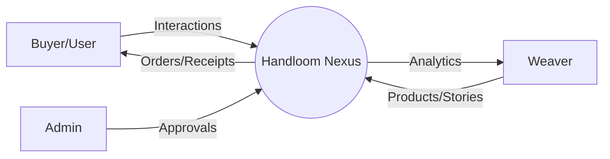
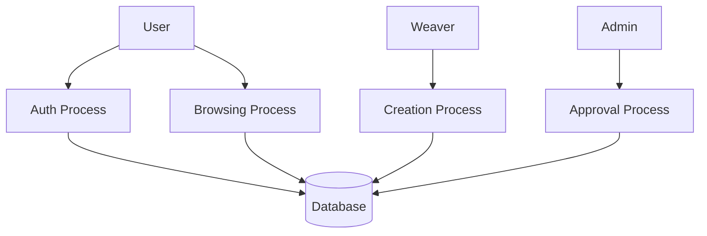
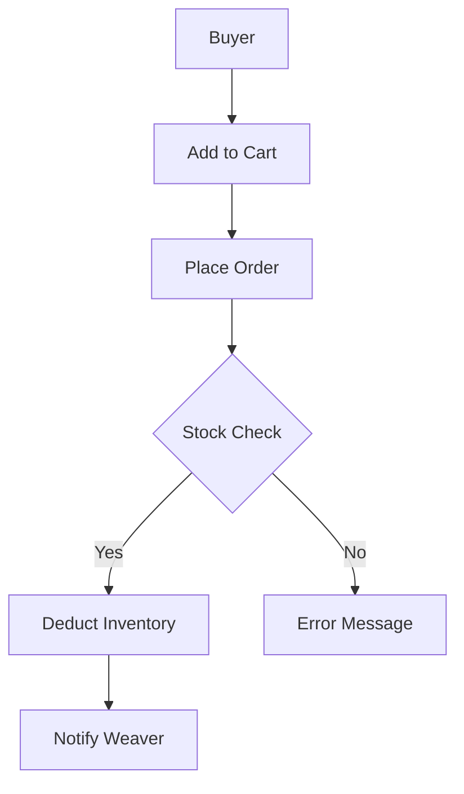
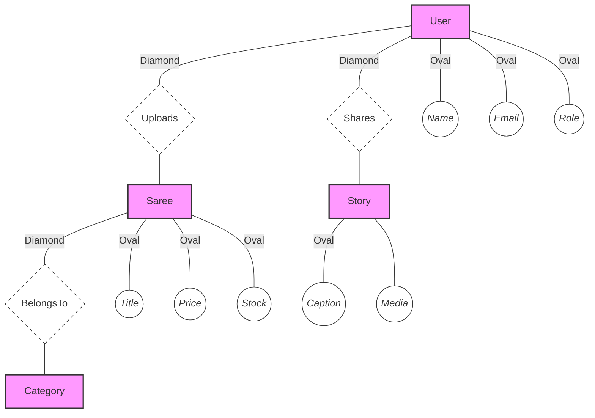

# MASTER PROJECT REPORT
## Handloom Weavers Nexus: A Scalable D2C Marketplace for Artisan Preservation

**Project Domain**: E-Commerce / Socio-Economic Tech  
**Developer**: Jaiganesh D. (iBOY)  
**Organization**: iBOY Innovation HUB  
**Academic Session**: 2025-2026  

---

## 📄 ABSTRACT
Handloom Weavers Nexus is an engineering solution designed to bridge the digital divide between traditional Indian weavers and the global marketplace. The project implements a robust Model-Controller-Route (MCR) architecture using the Node.js ecosystem and MySQL. The primary innovation lies in its "Artisan Stories" module, which leverages multi-media documentation to preserve the cultural lineage of handloom products. This report details the technical feasibility, architectural design, data flow dynamics, and implementation strategies of the platform.

---

## 📜 TABLE OF CONTENTS
1. [Chapter 1: Introduction](#chapter-1-introduction)
2. [Chapter 2: System Analysis](#chapter-2-system-analysis)
3. [Chapter 3: System Design](#chapter-3-system-design)
4. [Chapter 4: Implementation & Testing](#chapter-4-implementation--testing)
5. [Chapter 5: Conclusion & Future Scope](#chapter-5-conclusion--future-scope)
6. [Bibliography](#bibliography)

---

## 🏛 CHAPTER 1: INTRODUCTION

### 1.1 Project Overview
Handloom Weavers Nexus is a premium marketplace that empowers handloom artisans by providing a direct-to-consumer (D2C) platform. Unlike generic e-commerce platforms, it prioritizes the "Legacy of the Loom" through integrated storytelling and a high-fidelity user interface.

### 1.2 Motivation
The Indian handloom industry is a treasure trove of heritage, yet it suffers from "Middleman Exploitation" and "Narrative Loss". The project is motivated by the need for a tech-driven ecosystem that ensures fair compensation for weavers while providing buyers with authentic, verified products.

### 1.3 Problem Statement
Traditional weaving communities lack the technical infrastructure to showcase their craft. Current platforms are often too complex for non-technical users and do not provide the necessary "trust layer" for high-value handloom products.

### 1.4 Objectives
- **Direct Marketplace**: Eliminate intermediaries.
- **Story Integration**: Preserve artisan history through multi-media.
- **Quality Assurance**: Implement an Admin-driven approval workflow.
- **Visual Excellence**: Achieve a "vibe-centric" premium UI.

### 1.5 Scope
The system handles user authentication, product lifecycle management, multi-media story uploads, cart/wishlist management, and detailed sales analytics.

---

## 🛠 CHAPTER 2: SYSTEM ANALYSIS

### 2.1 Existing System Analysis
Current systems are either highly generic (Amazon/Flipkart) or purely offline. 
- **Drawbacks**: High commissions, lack of artisan identity, and no focus on the product's cultural origin.

### 2.2 Proposed System Analysis
Handloom Weavers Nexus focuses on **Social Commerce**. It introduces a dedicated "Story" layer alongside the "Product" layer, ensuring every purchase is backed by an artisan's legacy.

### 2.3 Feasibility Study
| Type | Description |
| :--- | :--- |
| **Technical** | Uses industry-standard Node.js and MySQL. Low latency and high consistency. |
| **Operational** | Managed via a three-tier RBAC (Admin, Weaver, Buyer) system. |
| **Economic** | Opens global markets for local artisans with minimal infrastructure cost. |

### 2.4 Software & Hardware Requirements
- **Hardware**: Server with 4GB+ RAM, 20GB SSD, GPU for image processing (optional).
- **Software**: Node.js v14+, MySQL 8.0, Multer (Media Uploads), Bcrypt (Security).

---

## 📐 CHAPTER 3: SYSTEM DESIGN

### 3.1 System Architecture
The platform utilizes a **Three-Tier Architecture**:
1. **Presentation Layer**: HTML5, Vanilla JS, CSS3.
2. **Business Logic Layer**: Express middleware and controllers.
3. **Data Layer**: MySQL Relational Database.

### 3.2 Data Flow Diagrams (DFD)

#### DFD Level 0 (Context Diagram)

#### DFD Level 1 (Process Overview)

#### DFD Level 2 (Order Fulfilling Detail)

### 3.3 ER Diagram (Chen Notation Style)
*Representing Entities in Rectangles, Attributes in Ovals, and Relationships in Diamonds.*

### 3.4 Database Dictionary
| Table | Primary Key | Key Attributes |
| :--- | :--- | :--- |
| `users` | `id` | `name`, `email`, `role`, `is_approved` |
| `sarees` | `id` | `title`, `price`, `weaver_id`, `category_id` |
| `weaver_stories`| `id` | `caption`, `media_paths`, `media_type` |
| `orders` | `id` | `buyer_id`, `total_amount`, `status` |

---

## 🚀 CHAPTER 4: IMPLEMENTATION & TESTING

### 4.1 Implementation Strategy
The project was developed following the **Agile Methodology**. 
- **Modularization**: Independent logic for Auths, Products, and Stories.
- **Stateless API**: Using server-side sessions for secure interaction.

### 4.2 Module Description
- **Admin Portal**: Bulk quality checks and user management.
- **Weaver Dashboard**: Visual analytics for sales and story engagement.
- **Buyer Interface**: Premium gallery and seamless checkout.

### 4.3 Testing Strategy
| Scenario | Module | Expected Outcome | Status |
| :--- | :--- | :--- | :--- |
| **TC-01** | Security | 401 Unauthorized for Guest access | SUCCESS |
| **TC-02** | Media | Multi-image preview in admin portal | SUCCESS |
| **TC-03** | Checkout | Inventory deduction on purchase | SUCCESS |

---

## 🔮 CHAPTER 5: CONCLUSION & FUTURE SCOPE

### 5.1 Conclusion
Handloom Weavers Nexus provides a technologically advanced platform for traditional artisans. It successfully combines e-commerce with a socio-cultural narrative, ensuring both profitability and preservation.

### 5.2 Future Roadmap
- **AI-Powered Recommendations**: Personalized saree suggestions based on user preference.
- **Blockchain for Authenticity**: Verifying the "Originality" of weaves via NFT-based certificates.
- **PWA Development**: A specialized lite-app for on-field weavers.

---

## 📚 BIBLIOGRAPHY
1. "Clean Code: A Handbook of Agile Software Craftsmanship" - Robert C. Martin.
2. Documentation: Node.js (expressjs.com), MySQL (mysql.com).
3. Design Inspiration: Notion-Icons ecosystem.

---

  
<b>Developed by iBOY Innovation HUB</b>

  
<i>Innovation isn’t just what you do — it’s who YOU are.</i>

