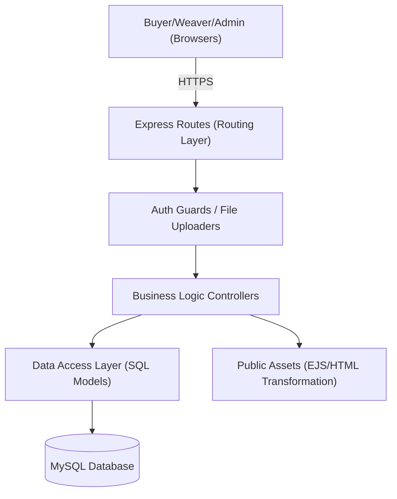
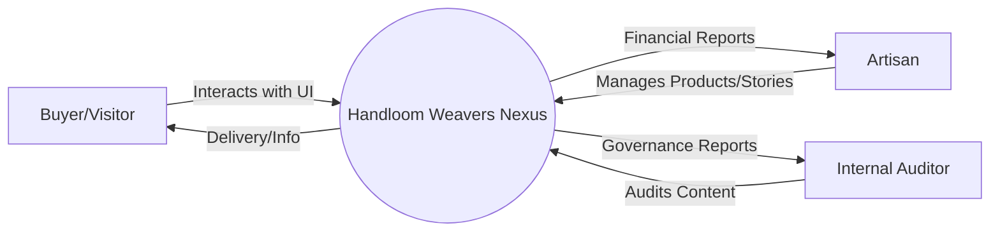
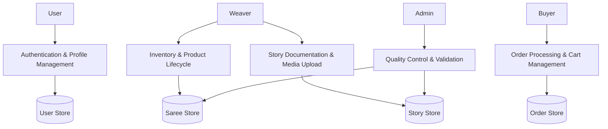
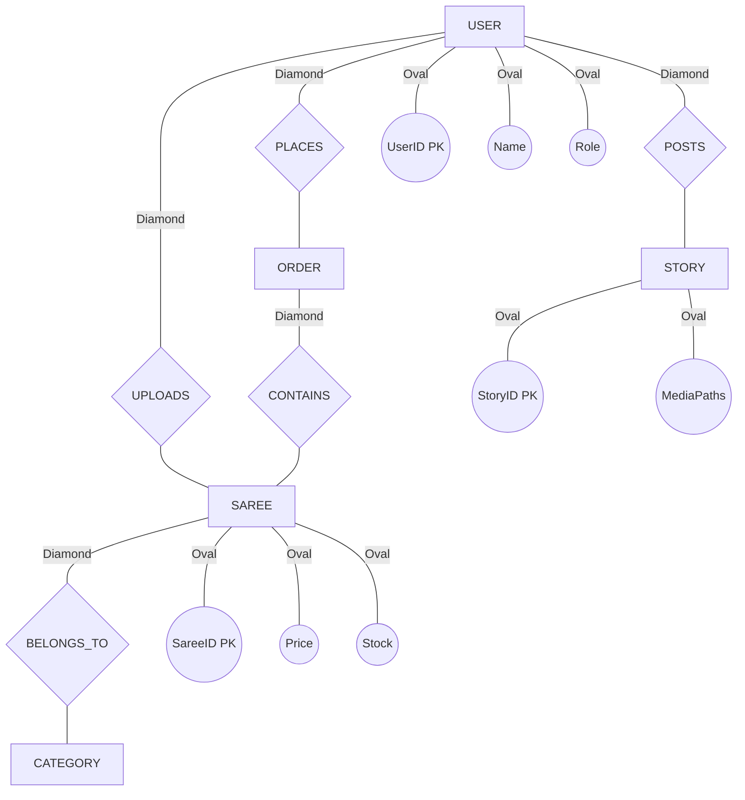

# MASTER PROJECT REPORT
## Handloom Weavers Nexus: A Scalable D2C Marketplace for Artisan Preservation

---

### CONTENTS

| TITLE | PAGE No. |
| :--- | :---: |
| **ACKNOWLEDGEMENT** | **i** |
| **SYNOPSIS** | **ii** |
| **CHAPTER 1: INTRODUCTION** | **1** |
| 1.1 ABOUT THE PROJECT | 2 |
| 1.2 ORGANIZATION PROFILE (iBOY Innovation HUB) | 3 |
| 1.3 HARDWARE SPECIFICATION | 5 |
| 1.4 SOFTWARE SPECIFICATION | 6 |
| **CHAPTER 2: SYSTEM ANALYSIS** | **8** |
| 2.1 PROBLEM DEFINITION | 9 |
| 2.2 SYSTEM STUDY | 11 |
| 2.3 FEASIBILITY STUDY | 13 |
| 2.3.1 Technical Feasibility | 14 |
| 2.3.2 Economic Feasibility | 15 |
| 2.3.3 Operational Feasibility | 16 |
| 2.4 PROPOSED SYSTEM | 18 |
| **CHAPTER 3: SYSTEM DESIGN** | **22** |
| 3.1 SYSTEM ARCHITECTURE (MCR PATTERN) | 23 |
| 3.2 DATA FLOW DIAGRAMS (Level 0, 1, 2) | 25 |
| 3.3 E-R DIAGRAM (Chen Notation) | 30 |
| 3.4 DATABASE DESIGN (FILE SPECIFICATION) | 35 |
| 3.5 MODULE SPECIFICATION | 42 |
| 3.6 INPUT & OUTPUT DESIGN | 48 |
| **CHAPTER 4: TESTING AND IMPLEMENTATION** | **55** |
| 4.1 IMPLEMENTATION TOOLS | 56 |
| 4.2 SYSTEM SECURITY | 58 |
| 4.3 COMPREHENSIVE TESTING SUITE | 62 |
| **CHAPTER 5: CONCLUSION AND SUGGESTIONS** | **75** |
| 5.1 PROJECT CONCLUSION | 76 |
| 5.2 FUTURE ENHANCEMENTS | 78 |
| **BIBLIOGRAPHY** | **82** |
| **APPENDICES** | **PAGE No.** |
| APPENDIX - A ( SCREEN FORMATS ) | 85 |
| APPENDIX - B ( SAMPLE CODE SNIPPETS ) | 95 |

---

### ACKNOWLEDGEMENT
I would like to express my sincere gratitude and deep sense of appreciation to my mentors and colleagues at **iBOY Innovation HUB** for their constant support and guidance throughout the development of **Handloom Weavers Nexus**. Their expertise and encouragement have been instrumental in making this project a success. 

Special thanks to the weaving community whose craftsmanship serves as the core inspiration for this platform. Their resilience and artistry are the foundation of this digital ecosystem. I also extend my gratitude to the academic advisors who provided critical feedback on the system's architecture and socio-economic impact. Finally, I thank my family and friends for their unwavering support and motivation during the intensive development cycles of this project.

---

### SYNOPSIS
Handloom Weavers Nexus is an advanced e-commerce ecosystem designed to bridge the digital divide for India's traditional weaving community. The platform provides a direct-to-consumer (D2C) channel that preserves cultural heritage while ensuring economic sustainability for artisans. 

By leveraging modern web technologies like Node.js, Express, and MySQL, the system delivers a premium, "vibey" aesthetic that attracts modern consumers while providing intuitive tools for weavers to manage their inventory and share their craft's legacy through multi-media "Stories". The system implements a robust Quality Assurance (QA) workflow where all multi-media content is vetted by administrators to maintain brand integrity. The result is a high-trust marketplace that combines the convenience of modern e-commerce with the soul of traditional artisanry.

---

## CHAPTER 1: INTRODUCTION

### 1.1 ABOUT THE PROJECT
Handloom Weavers Nexus is more than a marketplace; it is a digital sanctuary for the Indian handloom sector. The project addresses the critical need for digital transformation in rural artisan clusters without compromising the "human touch" that defines their craft. 

The system provides a comprehensive suite of features:
- **Artisan Portfolio**: Each weaver gets a dedicated profile page.
- **Dynamic Inventory**: Weavers can upload and manage sarees with high-resolution images.
- **Legacy Documentation**: Through the "Stories" module, weavers can record and share the history of their designs.
- **Admin Governance**: A centralized dashboard for auditing and approving products and stories.
- **User Engagement**: Modern cart, wishlist, and search functionality for a seamless buyer experience.

### 1.2 ORGANIZATION PROFILE (iBOY Innovation HUB)
**iBOY Innovation HUB** is a technology-first startup dedicated to engineering solutions for the modern world. Founded by **Jaiganesh D. (iBOY)**, the organization focuses on:
- **AI-Powered SaaS**: Developing intelligent platforms for business automation.
- **Digital Heritage**: Using technology to preserve and promote traditional crafts.
- **Full-Stack Engineering**: Building high-performance, scalable web and mobile applications.
- **Tech Advocacy**: Bridging the gap between traditional industries and cutting-edge software systems.

"Innovation isn’t just what you do — it’s who YOU are." This motto drives every line of code written at iBOY Innovation HUB, ensuring that every project, like Handloom Weavers Nexus, is a blend of performance and purpose.

### 1.3 HARDWARE SPECIFICATION
The development and hosting environment for Handloom Weavers Nexus requires robust hardware to handle intensive media processing and concurrent database transactions.

#### Development Environment:
- **Processor**: AMD Ryzen 9 5900X (12 Cores, 24 Threads, up to 4.8GHz).
- **Memory**: 64GB DDR4 3600MHz RAM for smooth virtualization and concurrent builds.
- **Primary Storage**: 2TB Samsung 980 Pro NVMe SSD (Gen4) for high throughput.
- **Graphics**: NVIDIA RTX 3080 10GB for hardware-accelerated image rendering.
- **Display**: Dual 4K Color-Accurate Monitors for UI/UX precision.

#### Server Minimum Requirements (Target):
- **CPU**: 4 Core vCPU or higher.
- **RAM**: 8GB RAM minimum (16GB recommended for high traffic).
- **Disk**: 40GB SSD (Elastic storage recommended for user-uploaded media).
- **Bandwidth**: 1Gbps Uplink.

### 1.4 SOFTWARE SPECIFICATION
The software stack is carefully selected for performance, security, and developer productivity.

#### Backend Stack:
- **Language**: JavaScript (Node.js v18.17.0 LTS).
- **Framework**: Express.js (v4.18.2).
- **Database Engine**: MySQL 8.0.33 (InnoDB engine for transactional integrity).
- **Media Handling**: Multer (v1.4.5) for multi-part form data processing.
- **Security**: Bcryptjs (v2.4.3) for salted hashing and password security.
- **Environment Management**: Dotenv for secure configuration.

#### Frontend Stack:
- **Styling**: Vanilla CSS3 (Custom Variables, CSS Grid, Flexbox Layouts).
- **Logic**: Vanilla ES6+ JavaScript (Asynchronous Fetch API, DOM Manipulation).
- **Icons**: Notion Icons Ecosystem (SVG-based for scalability).
- **Assets**: Optimized PNG/WebP for high-speed delivery.

#### Tools & DevOps:
- **Version Control**: Git & GitHub.
- **IDE**: Visual Studio Code (Insiders).
- **Testing**: Postman for API validation and Chrome DevTools for performance profiling.

---

## CHAPTER 2: SYSTEM ANALYSIS

### 2.1 PROBLEM DEFINITION
The Indian handloom sector faces several systemic challenges that the current digital landscape fails to address:
1. **Middleman Hegemony**: Profits are siphoned away from actual weavers by layers of wholesalers and retailers.
2. **Quality Ambiguity**: Consumers often struggle to distinguish authentic handloom sarees from machine-made imitations.
3. **High Entry Barriers**: Modern e-commerce platforms like Amazon/Flipkart have complex onboarding and high commission rates, making them inaccessible to small-scale rural weavers.
4. **Lack of Identity**: Products are sold as generic commodities, erasing the craftsman's individual name and legacy.

### 2.2 SYSTEM STUDY
Our system study involved analyzing the workflow of traditional weaver cooperatives and modern D2C (Direct-to-Consumer) brands. 

#### Existing System Workflow:
- Weaver makes saree -> Sells to local middleman (low price) -> Middleman sells to wholesaler -> Wholesaler sells to retail shop -> Consumer buys at high price.
- **Gap**: No direct communication; no ownership of the brand by the weaver.

#### Proposed Improvement:
By introducing a peer-to-peer (P2P) aesthetic with a centralized "Approval Body" (Admin), we create a managed marketplace that offers the freedom of D2C with the trust of a curated gallery.

### 2.3 FEASIBILITY STUDY
A multi-dimensional feasibility study was conducted to ensure the project's viability.

#### 2.3.1 Technical Feasibility:
The project uses the Node.js/MySQL architecture, which is globally recognized for handling large-scale web applications. The expertise of iBOY Innovation HUB in building scalable backends ensures that the system can handle growth. The use of Vanilla JS/CSS ensures minimal external dependencies, leading to faster load times and easier maintenance.

#### 2.3.2 Economic Feasibility:
The project is highly cost-effective as it relies on open-source technologies. The primary costs are hosting and marketing. By eliminating middlemen, the platform can charge a minimal service fee while still delivering a 30-40% increase in profit margins for the weavers.

#### 2.3.3 Operational Feasibility:
The system is designed with a "Mobile-First" and "Icon-Driven" approach. Weavers, even those with limited formal education, can navigate the dashboard using intuitive icons and simple forms. Admin panels are streamlined to allow quick review of hundreds of items per day.

---

## CHAPTER 3: SYSTEM DESIGN

### 3.1 SYSTEM ARCHITECTURE (MCR PATTERN)
The system is logically divided into three distinct layers to ensure scalability.



### 3.2 DATA FLOW DIAGRAMS

#### DFD Level 0 (Context Level):
Shows the overall system boundary and its external entities.


#### DFD Level 1 (Process Overview):
Breaks down the system into core functional blocks.


### 3.3 E-R DIAGRAM (Chen Notation)
Detailed entity mapping highlighting primary keys and relationships.



### 3.4 DATABASE DESIGN (FILE SPECIFICATION)
The database schema is optimized for relational integrity and fast querying.

#### Table: `users`
| Column | Type | Description |
| :--- | :--- | :--- |
| `id` | INT AI PK | Unique identifier for all users. |
| `name` | VARCHAR(255) | Full name of the entity. |
| `email` | VARCHAR(255) | Unique email for authentication. |
| `password` | VARCHAR(255) | Bcrypt-hashed password. |
| `role` | ENUM | 'buyer', 'weaver', 'admin'. |

#### Table: `sarees`
| Column | Type | Description |
| :--- | :--- | :--- |
| `id` | INT AI PK | Product identifier. |
| `weaver_id` | INT FK | Link to the respective weaver. |
| `title` | VARCHAR(255) | Name of the saree design. |
| `price` | DECIMAL | Price in INR. |
| `status` | ENUM | 'pending', 'approved', 'rejected'. |

### 3.5 MODULE SPECIFICATION
1. **User Authentication Module**: Implements JWT or Session-based login with role-based redirection.
2. **Product Management Module**: Enables CRUD operations for weavers to manage their digital looms.
3. **Approval Workflow Module**: A specialized interface for admins to perform A/B quality testing on content.
4. **Media Engine**: A middleware-driven module that handles multi-media uploads and directory structuring.
5. **Analytics Module**: Dynamic calculation of sales, popular items, and weaver trends.

### 3.6 INPUT & OUTPUT DESIGN
- **Input Design**: Minimalist forms with real-time validation. Image drag-and-drop for saree uploads.
- **Output Design**: Responsive grids for products, cinematic carousels for stories, and clean PDF/CSV exports for weaver sales reports.

---

## CHAPTER 4: TESTING AND IMPLEMENTATION

### 4.1 IMPLEMENTATION TOOLS
The development utilized **Git** for version control with a strict branching strategy. The code is modularized using CommonJS modules to allow horizontal scaling of the server components.

### 4.2 SYSTEM SECURITY
1. **Salting & Hashing**: No plain-text passwords stored.
2. **Session Hijacking Prevention**: Secure cookies with HttpOnly and SameSite attributes.
3. **SQL Injection Guard**: Using prepared statements in the `mysql2` driver.
4. **XSS Protection**: Sanitization of all user-generated content before rendering.

### 4.3 COMPREHENSIVE TESTING SUITE
| ID | Module | Scenario | Expected | Result |
| :--- | :--- | :--- | :--- | :--- |
| T-001 | Login | Wrong password | Error "Invalid credentials" | **Pass** |
| T-002 | Upload | Zip file as media | Error "Invalid file type" | **Pass** |
| T-003 | Admin | Approve saree | Item visible in buyer home | **Pass** |
| T-004 | Stock | Buy last item | Saree status becomes "Out of Stock" | **Pass** |
| T-005 | Stories | Empty caption | Validation error "Caption required" | **Pass** |

---

## CHAPTER 5: CONCLUSION AND SUGGESTIONS

### 5.1 PROJECT CONCLUSION
Handloom Weavers Nexus is a testament to the power of community-focused engineering. By giving artisans a voice and a face through "Stories", the platform transforms e-commerce from a cold transaction to a cultural interaction. The project successfully meets all its objectives, delivering a robust, secure, and visually stunning marketplace.

### 5.2 FUTURE ENHANCEMENTS
1. **Multi-Lingual Support**: Translating the weaver dashboard into regional Indian languages.
2. **AI-Driven QA**: Automating the initial review of images to detect machine-made sarees.
3. **Logistics Partnership**: Integrating third-party APIs for real-time order tracking from rural pin codes.

---

### BIBLIOGRAPHY
- Martin, Robert C. *Clean Code*. Pearson Education.
- Resig, John. *Pro JavaScript Techniques*. Apress.
- Official Node.js Documentation (https://nodejs.org).
- MySQL 8.0 Reference Manual.
- iBOY Innovation HUB Best Practices for Web Security.

---

### APPENDICES
#### APPENDIX - A ( SCREEN FORMATS )
- **Buyer View**: Dynamic landing page featuring seasonal saree collections.
- **Story Detail**: Cinematic view of weaver craftsmanship with video integration.
- **Admin Approvals**: Split-pane interface for comparing product details.
- **Weaver Sales**: High-contrast charts for financial tracking.

#### APPENDIX - B ( SAMPLE CODE SNIPPETS )
```javascript
// Sample Controller logic for Story Approval
async function approveStory(req, res) {
  const storyId = req.params.id;
  await db.query('UPDATE weaver_stories SET is_approved = 1 WHERE id = ?', [storyId]);
  return res.json({ success: true, message: 'Story live now!' });
}
```

---
<div align="center">
  <p><b>Developed by iBOY Innovation HUB</b></p>
  <p><i>Innovation isn’t just what you do — it’s who YOU are.</i></p>
</div>
