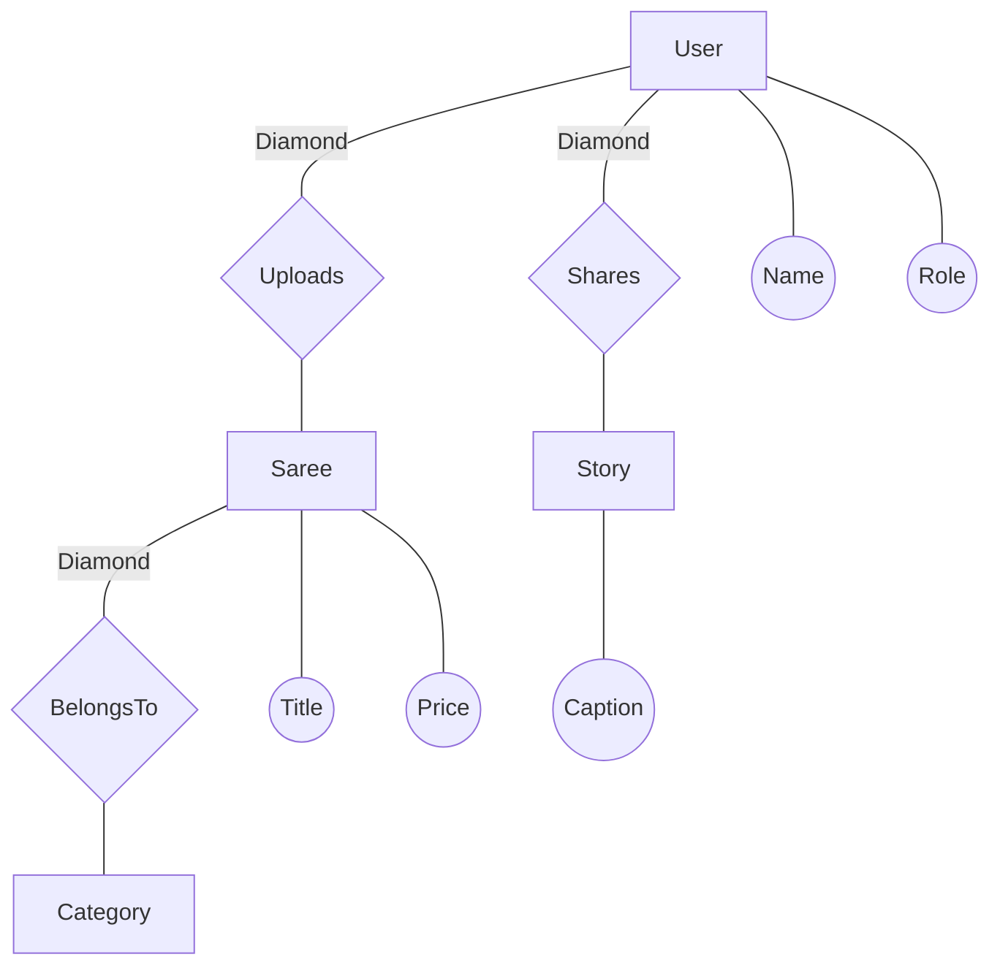
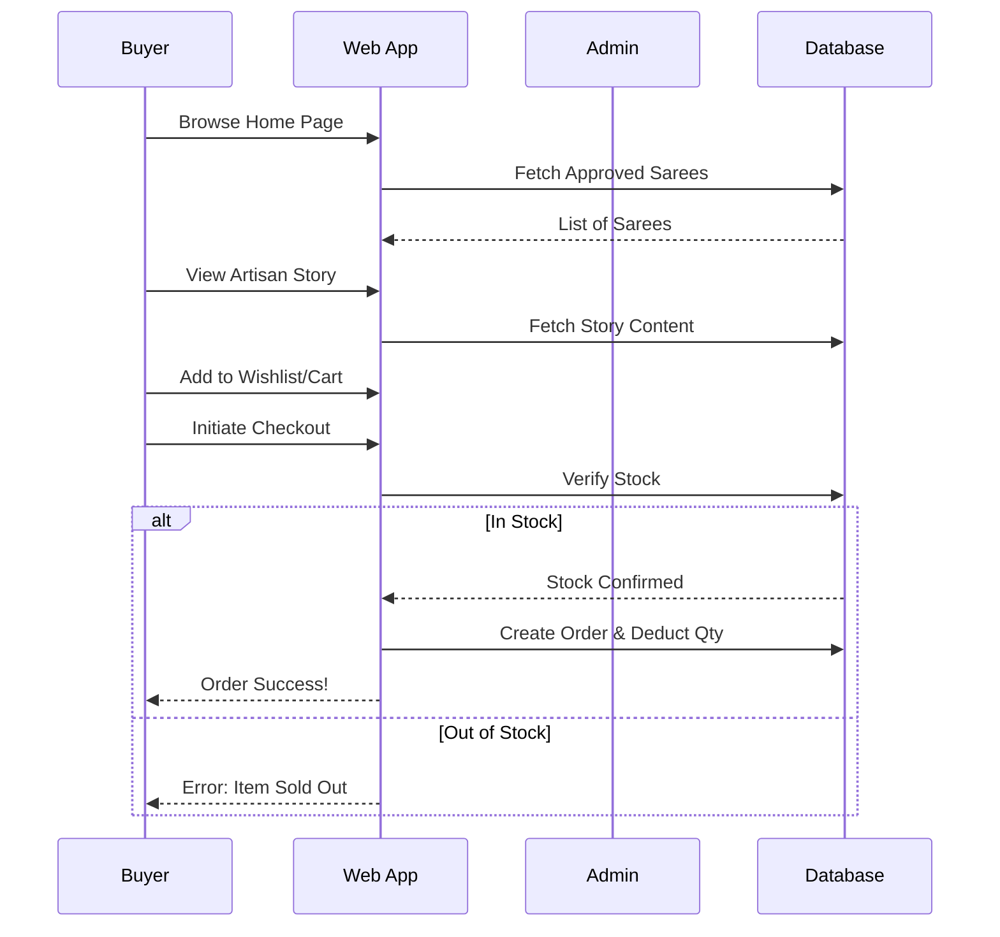
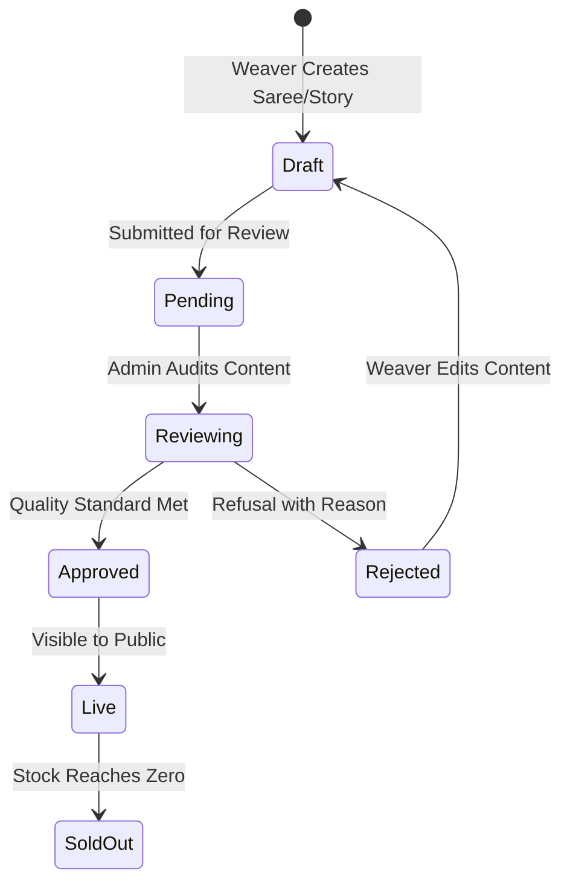
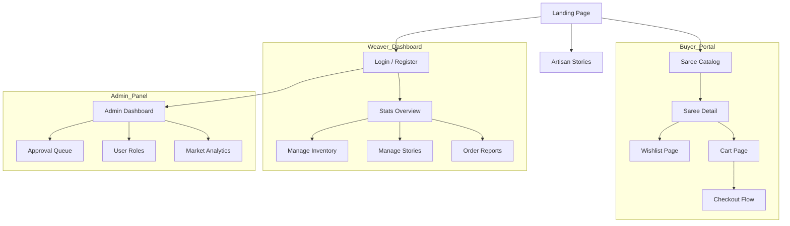

# Handloom Weavers Nexus
### *Preserving the Legacy of the Loom through Digital Innovation*

Handloom Weavers Nexus is an advanced D2C marketplace designed to connect India's legendary weavers directly with global consumers. The platform integrates traditional craftsmanship with modern e-commerce engineering, prioritizing artisan identity and quality assurance.

---

## 👤 DEVELOPER PROFILE
**Name**: Jaiganesh D. (iBOY)  
**Company**: iBOY Innovation HUB  
**Email**: [iboy.innovationhub@gmail.com](mailto:iboy.innovationhub@gmail.com)  
**GitHub**: [github.com/iBOYJAI](https://github.com/iBOYJAI/)

### 💼 Professional Bio
Jaiganesh D. (iBOY) is the Founder of **iBOY Innovation HUB**, a technology startup focused on building AI-powered SaaS platforms, automation tools, and future-ready digital solutions. He specializes in Full-Stack Development, Artificial Intelligence integration, backend systems, and scalable startup architecture.

"Innovation isn’t just what you do — it’s who YOU are."

---

## 🛡 WHY HANDLOOM WEAVERS NEXUS?
Beyond just a store, we provide a secure and scalable infrastructure for the weaving ecosystem:
- **Premium Performance**: Built with Vanilla JS and CSS for near-instant load times.
- **Security First**: PBKDF2-equivalent hashing, session guarding, and SQL injection prevention.
- **Narrative Depth**: Integrated multi-media engine to bridge the emotional gap between weaver and buyer.
- **Administrative Transparency**: Comprehensive auditing loops for all marketplace activities.

---

## 🏛 TECHNICAL ARCHITECTURE

### Entity Relationship Diagram (ERD - Chen Style)


### Advanced User Flow (Buyer Journey)


### Marketplace Workflow (Content Life-cycle)


### Platform Sitemap (Map Visualization)


---

## 📂 PROJECT STRUCTURE
```text
Handloom Weavers Nexus/
├── COMPLETE_PROJECT_REPORT.md  # Detailed Academic Engineering Report
├── LICENSE                     # MIT Open-Source License
├── README.md                   # Project Overview & Deployment Guide
├── setup.bat                   # Automation: One-click Environment Setup
├── start.bat                   # Automation: One-click Server Launch
├── config/                     # DB & API Configuration
├── controllers/                # Business Logic (MCR Architecture)
├── database/                   # Schema (SQL) & Verified Image Seeds
├── middleware/                 # Auth Guards & Media Handlers
├── models/                     # SQL Model Queries
├── public/                     # Frontend Assets (HTML, CSS, JS)
├── routes/                     # Express Endpoint Routing
└── scripts/                    # Maintenance & Recovery Scripts
```

---

## 🚀 GETTING STARTED

### Prerequisites
- Node.js (v18 or higher)
- MySQL (v8.0 or higher)

### Installation
1. **Automated Setup (Windows)**:
   - Run `setup.bat`. This will install all dependencies and prompt you to initialize the database.
2. **Launch Application**:
   - Run `start.bat` to launch the server at `http://localhost:3000`.

---

## 🌐 GITHUB DEPLOYMENT
```bash
git init
git add .
git commit -m "feat: first commit - comprehensive project finalization"
git branch -M main
git remote add origin https://github.com/iBOYJAI/handloom-weavers-nexus.git
git push -u origin main
```

---

<div align="center">
  <h3>Software Licensing</h3>
  <p>This project is licensed under the MIT License. Technical and legal provisions are detailed in the <a href="LICENSE">LICENSE</a> file.</p>
  
  <p><b>Developed by iBOY Innovation HUB</b></p>
  <p><i>"Innovation isn’t just what you do — it’s who YOU are."
</i></p>
</div>